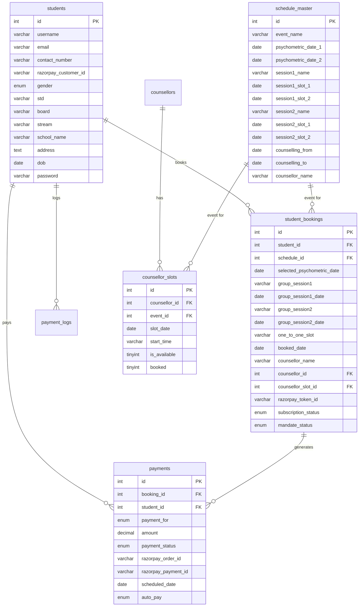

# TEMB2C — Full Architecture Report

> **Project**: TEM Academy Career Counselling B2C Platform  
> **Stack**: PHP 8.2 + MariaDB 10.4 + Razorpay SDK + PHPMailer + Tailwind CSS  
> **Environment**: XAMPP (localhost) / Apache  
> **Author**: Surya Sundar  
> **Report Date**: February 2026

---

## 1. Project Overview

TEMB2C is a web-based **career counselling booking and payment platform** for students. It allows students to register, book a structured counselling programme, authorize recurring payments via Razorpay e-mandate, and attend sessions managed by admin-assigned counsellors.

The platform has **three distinct user roles**:
| Role | Portal | Purpose |
|---|---|---|
| **Student** | Root (`/`) | Register, book sessions, pay fees |
| **Admin** | `/admin` | Manage events, counsellors, slots, reports |
| **Counsellor** | `/counsellor` | View appointments, upload session notes |

---

## 2. Technology Stack

| Layer | Technology |
|---|---|
| **Backend Language** | PHP 8.2 |
| **Database** | MariaDB 10.4 (via PDO) |
| **Payment Gateway** | Razorpay (SDK v2.9 via Composer) |
| **Email (Transactional)** | PHPMailer v7 (SMTP via Gmail) |
| **Email (OTP)** | MSG91 REST API |
| **Frontend CSS** | Tailwind CSS v3 (CDN) + custom `style.css` |
| **Frontend Icons** | Font Awesome |
| **Web Server** | Apache (XAMPP) |
| **Autoloading** | Composer PSR-4 |

---

## 3. Directory Structure

```
temb2c/
├── admin/               Admin panel (17 files)
├── counsellor/          Counsellor portal (8 files)
├── vendor/              Composer packages (Razorpay SDK, PHPMailer)
├── other/               Notes and misc files
│
├── db.php               PDO database connection
├── config.php           Centralized config (Razorpay keys, fees, SMTP, MSG91)
├── security_helper.php  IP-based rate limiting class
├── mail_helper.php      All email notification functions
│
├── index.html           Public landing page
├── login.php            Student login
├── signup.php           Student registration + OTP verification
├── forgot_password.php  Password reset flow
│
├── dashboard.php        Student dashboard (session & payment status)
├── booknow.php          4-step booking wizard
├── schedule.php         My schedule view
├── profile.php          Student profile
├── payments.php         Payment history
│
├── payment.php          Razorpay order creation + checkout UI
├── mandate_success.php  Post-mandate callback handler
├── final_payment.php    Manual session payment page
├── final_success.php    Payment success confirmation
│
├── webhook.php          Razorpay webhook handler (server-side events)
├── auto_debit.php       Daily cron job for recurring auto-debit
├── process_queue.php    Email queue processor
├── cancel_autopay.php   Student cancels their mandate
│
├── style.css            Custom CSS design tokens
└── migration_v*.sql     Database migration history
```

---

## 4. Database Schema

### 4.1 Tables Overview



### 4.2 Key Relationships
- One **event** (`schedule_master`) → Many **bookings** (`student_bookings`)
- One **booking** → 3 **payment records** (`payments`): PSYCHOMETRIC, GROUP, ONE_TO_ONE
- One **counsellor** → Many **slots** (`counsellor_slots`)
- A booking references one **counsellor_slot** (specifically locked during booking)

---

## 5. Module Breakdown

### 5.1 Student Portal (`/`)

| File | Purpose |
|---|---|
| `index.html` | Public landing page (static, no PHP) |
| `signup.php` | Multi-step registration form with OTP email verification |
| `login.php` | Session-based login with rate limiting |
| `forgot_password.php` + `reset_password.php` | Token-based password reset |
| `dashboard.php` | Shows active booking + payment status for all 3 sessions |
| `booknow.php` | 4-step booking wizard (see Section 6) |
| `schedule.php` | View complete booked schedule |
| `payments.php` | Full payment history table |
| `profile.php` | Edit student profile |
| `cancel_autopay.php` | Cancel Razorpay mandate |
| `sidebar.php` + `header.php` + `footer.php` | Shared layout includes |

### 5.2 Admin Panel (`/admin`)

| File | Purpose |
|---|---|
| `dashboard.php` | Summary stats |
| `events.php` | List all events |
| `create_event.php` | Create a new counselling event/schedule |
| `edit_event.php` | Edit event details |
| `delete_event.php` | Delete event |
| `counsellors.php` | List all counsellors |
| `create_counsellors.php` | Add new counsellors |
| `slots.php` | Manage counsellor time slots per event |
| `students.php` | View all registered students |
| `student_view.php` | Detailed student profile + booking |
| `calendar.php` | Calendar view of counsellor slots |
| `export_event_excel.php` | Export full event report as CSV |
| `login.php` + `logout.php` | Admin authentication |

### 5.3 Counsellor Portal (`/counsellor`)

| File | Purpose |
|---|---|
| `login.php` + `logout.php` | Counsellor authentication |
| `dashboard.php` | Summary of upcoming appointments |
| `appointments.php` | List all booked sessions for the counsellor |
| `upload.php` | Upload session notes/files |
| `topbar.php` + `sidebar.php` | Shared layout |

---

## 6. Complete User Journeys

### 6.1 Student Registration Flow

```
index.html (Landing Page)
   ↓
signup.php (Fill registration form)
   ↓ (submit form)
signup.php (Send OTP via MSG91 to email)
   ↓
verify_otp.php (Enter OTP)
   ↓ (OTP verified)
login.php → dashboard.php
   ↓ (welcome email queued)
mail_queue table → process_queue.php (cron) → Email sent
```

### 6.2 Booking Flow

```
dashboard.php (No booking found)
   ↓ → booknow.php
   
STEP 1: Pick Psychometric Date (Option A or B)
   ↓
STEP 2: Pick Group Session 1 Date
   ↓
STEP 3: Pick Group Session 2 Date
   ↓
STEP 4: Pick 1:1 Counselling Date + Time Slot
        (AJAX fetch to ?get_slots=1&date=... → returns available slots)
   ↓ Submit form (POST)

booknow.php server-side:
  1. BEGIN TRANSACTION
  2. Check for duplicate booking (FOR UPDATE lock)
  3. SELECT available counsellor slot (ORDER BY RAND(), LIMIT 1, FOR UPDATE)
  4. INSERT into student_bookings
  5. UPDATE counsellor_slots SET booked=1
  6. COMMIT
  7. Redirect → payment.php?booking_id=X
```

### 6.3 Payment Flow (Razorpay e-Mandate)

```
payment.php
  1. Fetch booking + student details
  2. Create or fetch Razorpay Customer (razorpay_customer_id stored in students)
  3. Create Razorpay Order (₹1 token for mandate auth)
  4. Store txnid (order_id) in student_bookings
  5. Render checkout page → Razorpay Checkout JS opens
  ↓ (student pays ₹1 via UPI/Card/Netbanking)
  
Handler redirects to → mandate_success.php?booking_id=X&payment_id=Y

mandate_success.php
  1. Fetch payment from Razorpay API
  2. Auto-capture if 'authorized'
  3. Update student_bookings (payment_status='paid', token_id, subscription_status='authenticated')
  4. INSERT 3 payment records in payments table:
     - PSYCHOMETRIC (amount ₹999, scheduled = psychometric_date)
     - GROUP (amount ₹999, scheduled = group_session1_date)
     - ONE_TO_ONE (amount ₹1999, scheduled = booked_date)
  5. Log to payment_logs
  6. Queue booking confirmation email
  7. Redirect → dashboard.php
```

### 6.4 Auto-Debit Flow (Recurring Payments)

```
auto_debit.php (Run daily via cron/Task Scheduler)
  ↓
  Finds PENDING payments where:
    - scheduled_date = TOMORROW
    - mandate_status = ACTIVE
    - razorpay_token_id IS NOT NULL

  For each payment:
    1. Call Razorpay API: createRecurring(customer_id, token_id, amount)
    2. Update payments table with new razorpay_payment_id
    3. Log to payment_logs
    4. If FAIL → sendPaymentFailed() email

  ↓ Razorpay processes payment asynchronously ↓

webhook.php (Razorpay POSTs to this URL)
  Handles:
  - payment.captured  → Mark payment PAID, send receipt email
  - payment.failed    → Mark payment FAILED, send failure email
  - token.confirmed   → Update booking to 'active' mandate
  - subscription.charged → Mark subscription payment PAID
  - subscription.cancelled → Mark mandate CANCELLED
```

### 6.5 Manual Session Payment Flow

```
dashboard.php (Pay Now button, visible 1 day before session)
   ↓ → final_payment.php?booking_id=X&type=PSYCHOMETRIC
   
   Creates new Razorpay order for the specific session fee
   Opens Razorpay Checkout
   ↓ (student pays)
   
final_success.php
   Updates payments.payment_status='PAID'
   Sends payment receipt email
```

---

## 7. Fee Structure

| Session Type | Fee | When Charged |
|---|---|---|
| Token / Mandate Auth | ₹1 | At booking, authorizes e-mandate |
| Psychometric Test | ₹999 | Auto-debit 1 day before session |
| Group Session | ₹999 | Auto-debit 1 day before session |
| 1:1 Counselling | ₹1,999 | Auto-debit 1 day before session |
| **Total** | **₹3,998** | Split across 3 auto-debits |

---

## 8. Email System

Two sending modes are used:

### 8.1 Queued Emails (via `mail_queue` table)
Used for: Welcome email, Booking confirmation  
- Email content is inserted into `mail_queue` table with `status='pending'`
- `process_queue.php` cron processes and sends them via PHPMailer/SMTP
- Retries on failure (tracks `attempts` and `last_attempt`)

### 8.2 Direct Emails (sent immediately)
Used for: Payment receipt, Payment failed notification  
- Sent synchronously using PHPMailer SMTP within the webhook handler

### 8.3 OTP Emails
- Sent via **MSG91 REST API** during signup/OTP verification
- Uses MSG91 template `global_otp`

---

## 9. Security

| Feature | Implementation |
|---|---|
| **Authentication** | PHP `$_SESSION` for all three portals (student, admin, counsellor) |
| **Password Storage** | `password_hash()` / `password_verify()` (BCrypt) |
| **Rate Limiting** | `SecurityHelper` class uses `rate_limits` DB table — limits by IP + action type |
| **SQL Injection** | All queries use PDO prepared statements |
| **XSS Prevention** | `htmlspecialchars()` on all user-supplied output |
| **CSRF Protection** | Booking form uses a `booking_token` session token |
| **Race Condition** | Booking uses DB transactions with `FOR UPDATE` row locks |
| **Webhook Verification** | Razorpay signature verified via HMAC-SHA256 (when secret is configured) |
| **OTP Expiry** | OTP verified via session with expiry (in `signup.php`) |

---

## 10. Data Flow Summary

```
[Student Browser]
     |
     |  HTTP Request
     ↓
[Apache / PHP]
     |
     |── db.php ──────────────► [MariaDB Database]
     |── config.php             (PDO prepared statements)
     |── security_helper.php    rate_limits table
     |── mail_helper.php
          |── PHPMailer  ──────► [Gmail SMTP]
          |── MSG91 API  ──────► [MSG91 (OTP)]
     |
     |── Razorpay PHP SDK ────► [Razorpay API]
          |                     (Customer, Order, Payment, Token)
          ↑
          |  Webhooks (async)
          |
     webhook.php ─────────────► [MariaDB: payments, payment_logs, student_bookings]
          |── mail_helper.php ─► [Gmail SMTP: Receipt / Failure emails]
     |
     auto_debit.php (cron)─────► [Razorpay API: createRecurring]
          |── mail_helper.php ─► [Gmail SMTP: Failure emails]
```

---

## 11. Admin Workflow

1. Create an event in **Create Event** (sets dates for all sessions, counselling range)
2. Add **counsellors** in the Counsellors section
3. Add **time slots** for each counsellor per event from the Slots page
4. Students register, book, and pay automatically
5. Admin can:
   - View all students and bookings in **Students** section
   - See slot availability in **Calendar** view
   - Export a full CSV report from **Export Event Excel**

---

## 12. Known Issues & Recommendations

| Area | Issue | Recommendation |
|---|---|---|
| **Webhook Secret** | `RAZORPAY_WEBHOOK_SECRET` is still placeholder `YOUR_WEBHOOK_SECRET_HERE` | Set the actual secret from Razorpay Dashboard |
| **Config Security** | API keys and SMTP credentials are hardcoded in `config.php` | Move to `.env` file, add `config.php` to `.gitignore` |
| **Email Queue** | `process_queue.php` must be run as a cron job manually | Set up Windows Task Scheduler or server cron |
| **Auto-Debit** | `auto_debit.php` must be scheduled daily | Set up scheduled task: `php auto_debit.php` every day at 8 AM |
| **Group Session Payment** | Only `GROUP` type (single record) is created; both Group Session 1 and 2 share one payment record | Consider creating separate payment records for Group 1 and Group 2 |
| **BASE_URL** | Hardcoded as `http://localhost/temb2c` in `config.php` | Change to production URL before deploying |
| **Error Handling** | Some pages use `die()` directly for error messages | Implement user-friendly error pages |
| **Session Fixation** | No `session_regenerate_id()` after login | Add `session_regenerate_id(true)` in login handlers |

---

## 13. Cron Jobs Required

| Script | Frequency | Purpose |
|---|---|---|
| `php auto_debit.php` | Daily (8 AM) | Charge students for tomorrow's sessions |
| `php process_queue.php` | Every 5 minutes | Send queued emails (welcome, booking confirmation) |
